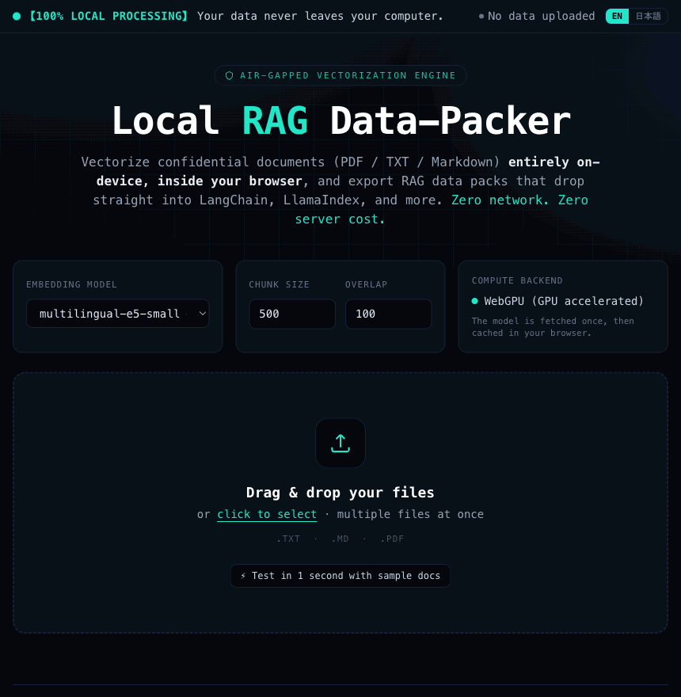

# 🛡️ Local RAG Data-Packer — Live Demo

**Vectorize confidential documents entirely in your browser. Zero network. Zero server cost.**

▶️ **Live demo:** https://nagayu.github.io/local-rag-packer-demo/

Drop in PDF / TXT / Markdown and the app generates embedding vectors *on your own CPU/GPU,
inside the browser*, then exports a **RAG data pack (JSON / SQLite)** that loads straight into
LangChain, LlamaIndex, and friends. **Your document bytes are never sent over the network.**



## Highlights
- 🔒 **100% local processing** — no backend, no data egress.
- ⚡ **WebGPU / WASM** auto-switch (GPU where available, CPU fallback otherwise).
- 🌐 **English & Japanese** UI (toggle, top-right) + a multilingual default model.
- 🧩 **Sentence-aware chunking** with overlap for high retrieval quality.
- 📦 **Portable output** — JSON and SQLite for any Python / Node RAG stack.

## Run locally
```bash
python3 -m http.server 8000   # then open http://localhost:8000
```
Or just open `index.html` directly.

## Tech
Transformers.js (in-browser ONNX, WebGPU/WASM) · pdf.js · sql.js · Tailwind (prebuilt).
Heavy work runs off-thread in a Blob-built module Worker (so it also runs from `file://`).

---
*This is a public demo build. © All Rights Reserved — see [LICENSE](LICENSE).*
